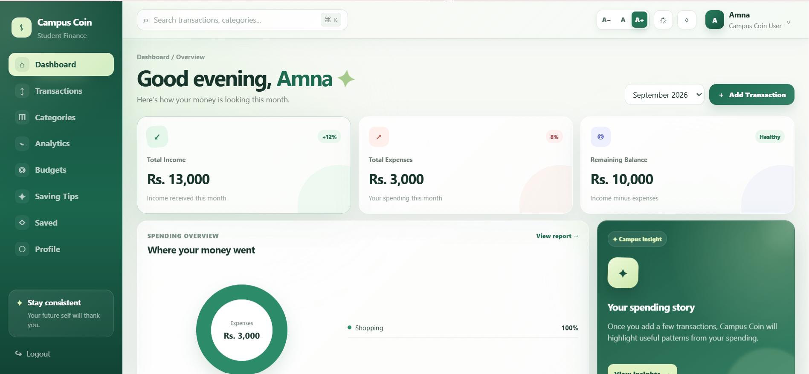

# Campus Coin 💰

### Smart Spending • Student Style

A full-stack, student-focused personal finance and budgeting web application designed to help college and university students track income, manage expenses, set budgets, analyze spending, and build better saving habits.

---

## 📌 Project Overview

**Campus Coin** is a responsive student finance management system created specifically around student spending patterns.

Unlike traditional finance applications that are often designed for salaried adults, Campus Coin focuses on student-relevant income and expenses such as allowance, part-time earnings, scholarships, food, transport, academics, subscriptions, hostel/rent, and entertainment.

The application provides separate **Student** and **Administrator** experiences and uses a PHP + MySQL backend for persistent financial data.

---

## 🖥️ Project Preview

<p align="center">
  
</p>

<p align="center">
  <b>Student Dashboard — Campus Coin</b>
</p>

---

## ✨ Key Features

### 👤 Authentication & Account Management

- Student registration and login
- Separate administrator login
- Session-based authentication
- Forgot password and password reset flow
- Editable student profile
- Academic year management
- Monthly allowance baseline
- Monthly savings goal

### 📊 Personalized Dashboard

- Personalized student greeting
- Monthly income overview
- Monthly expense overview
- Remaining balance
- Quick transaction entry
- Spending overview
- Financial highlights
- Budget-related information
- Saving insights and tips

### 💸 Transactions

- Add income and expenses
- Edit existing transactions
- Delete transactions
- Student-focused income and expense categories
- Recurring transaction support
- Recurring frequency and next-occurrence tracking
- Transaction history for edited/deleted records

### 🗂️ Category Management

Students can use default categories or create their own personal categories.

**Income categories include:**

- Allowance
- Part-time Job
- Scholarship
- Gift
- Other Income

**Expense categories include:**

- Food
- Transport
- Hostel / Rent
- Academics
- Subscriptions
- Entertainment
- Miscellaneous

### 📈 Reports & Analytics

- Category-wise spending reports
- Income vs expense analysis
- Spending trends
- Date-range filtering
- Category filtering
- Income-source filtering
- Monthly financial insights
- Report export as PDF
- Report export as PNG image
- Browser print / Save as PDF support

### 🎯 Budgets & Alerts

- Set monthly budgets by category
- Track budget consumption
- Compare actual spending against budget limits
- Budget progress indicators
- Near-budget and exceeded-budget notifications

### 💡 Saving Tips

- Student-focused saving suggestions
- Personalized tips based on financial activity
- Pin useful tips
- Dismiss unwanted tips
- Save tips for later reference

### 🔖 Saved Items

- Bookmark saving tips
- Save financial insights
- Review saved content later

### 👤 Profile Management

Students can manage:

- Name
- Academic year
- Monthly allowance baseline
- Monthly savings goal
- Account-related information

### 🛡️ Administrator Panel

A separate administrator area provides:

- Admin dashboard overview
- User management
- View / disable user accounts
- Default category management
- System announcements
- Tip templates
- Usage statistics
- Transaction and category insights
- Direct navigation between admin sections

### ♿ Accessibility & UI

- Responsive layout
- Dark mode
- Adjustable font size
- Mobile-friendly navigation
- Clear dashboard structure
- Loading and feedback states
- Consistent visual design
- Home-page sitemap for easier navigation

---

## 🛠️ Technology Stack

| Layer | Technology |
|---|---|
| Frontend | HTML5 |
| Styling | CSS3 |
| Client-side Logic | JavaScript |
| Backend | PHP |
| Database Access | PDO |
| Database | MySQL |
| Local Server | XAMPP / Apache |
| Version Control | Git |
| Repository Hosting | GitHub |

---

## 🏗️ Architecture

Campus Coin follows a simple three-layer web architecture:

```text
┌─────────────────────────────┐
│     Presentation Layer      │
│ HTML • CSS • JavaScript     │
└──────────────┬──────────────┘
               │
               ▼
┌─────────────────────────────┐
│    Application / API Layer  │
│        PHP • PDO            │
└──────────────┬──────────────┘
               │
               ▼
┌─────────────────────────────┐
│          Data Layer         │
│           MySQL             │
└─────────────────────────────┘
```

The frontend communicates with PHP backend endpoints, while PHP handles application logic, sessions, validation, and database operations through MySQL.

---

## 🗄️ Database

The relational database contains tables for:

- `users`
- `categories`
- `transactions`
- `budgets`
- `tip_preferences`
- `admin_content`
- `insight_history`
- `bookmarks`
- `transaction_history`

Foreign-key relationships are used to connect students with their categories, transactions, budgets, insights, and saved content.

Transaction history is maintained separately so edit/delete activity can remain available even after the active transaction changes.

---

## 📁 Project Structure

```text
Campus-Coin/
│
├── admin/
│   └── Administrator backend endpoints
│
├── backend/
│   ├── auth/
│   ├── categories/
│   ├── transactions/
│   ├── reports/
│   ├── budgets/
│   ├── insights/
│   ├── bookmarks/
│   ├── profile/
│   └── config/
│
├── database/
│   └── MySQL database schema
│
├── frontend/
│   ├── css/
│   ├── js/
│   ├── index.html
│   ├── register.html
│   ├── dashboard.html
│   ├── transactions.html
│   ├── categories.html
│   ├── reports.html
│   ├── budgets.html
│   ├── tips.html
│   ├── bookmarks.html
│   ├── profile.html
│   ├── admin_login.html
│   └── admin_dashboard.html
│
├── assets/
│   └── screenshots/
│
└── README.md
```

---

## 🚀 Getting Started

### Prerequisites

Make sure the following are installed:

- XAMPP
- PHP
- MySQL
- Apache
- A modern browser such as Chrome, Edge, or Firefox
- Git (optional, for cloning)

---

## 📥 Installation

### 1. Clone the repository

Open a terminal inside:

```text
C:\xampp\htdocs
```

Run:

```bash
git clone https://github.com/AnumNoor-dev/Campus-Coin.git campus_coin
```

Or download the repository as a ZIP and extract it as:

```text
C:\xampp\htdocs\campus_coin
```

### 2. Start XAMPP

Open **XAMPP Control Panel** and start:

```text
Apache
MySQL
```

Both services should be running.

### 3. Create the database

Open:

```text
http://localhost/phpmyadmin/
```

Create a database named:

```text
campus_coin_db
```

### 4. Import the schema

Open the `database` folder in this repository and import the supplied SQL schema into:

```text
campus_coin_db
```

### 5. Open Campus Coin

Student / Home:

```text
http://localhost/campus_coin/frontend/
```

Administrator Login:

```text
http://localhost/campus_coin/frontend/admin_login.html
```

---

## 🔐 Security & Data Handling

Campus Coin includes:

- Session-based authenticated access
- Password hash storage
- Unique user email handling
- User-specific financial records
- Relational database constraints

The application does **not** connect to real bank accounts and does not process real payments.

Campus Coin is an educational student-finance application, and financial tips or insights should be treated as guidance rather than professional financial advice.

---

## 🎨 UI Design

Campus Coin uses a clean green visual identity with:

- Card-based layouts
- Responsive dashboards
- Sidebar navigation
- Clear forms
- Charts and progress indicators
- Dark mode
- Adjustable typography
- Mobile-friendly layouts

The goal is to keep financial tracking simple, understandable, and student-friendly.

---

## 🎯 Project Goals

Campus Coin was developed to:

1. Make daily financial tracking easier for students.
2. Help students understand where their money goes.
3. Encourage monthly budgeting and saving habits.
4. Present financial information through simple reports and visual summaries.
5. Provide student-relevant saving guidance.
6. Maintain a clear and accessible user experience.
7. Provide administrative oversight for system management.

---

## 🔮 Possible Future Improvements

Future versions could include:

- AI-assisted transaction categorization
- More advanced spending forecasts
- CSV transaction import
- Email-based sharing of reports
- Online cloud deployment
- Additional analytics
- Expanded notification options

---

## 👥 Contributors

Developed as part of the **Campus Coin – End-to-End Web Solutions** project.

Project Theme:

```text
NextGen BudgetBee
```

---

## 🤖 AI-Assisted Development

AI-assisted tools were used as supporting aids during development activities such as:

- Debugging guidance
- Code review
- UI improvement ideas
- Diagram assistance
- Documentation drafting

The final project structure, implementation, testing, and project understanding remain the responsibility of the development team.

---

## 📜 Project Status

**Status:** Completed ✅

The current version includes the primary student finance workflow, administrative features, reporting, budgeting, saving tools, accessibility controls, and database-backed persistence.

---

## ⭐ Support

If you find this project useful or interesting, consider giving the repository a ⭐.

---

<p align="center">
  <b>Campus Coin</b><br>
  Smart Spending • Student Style
</p>
